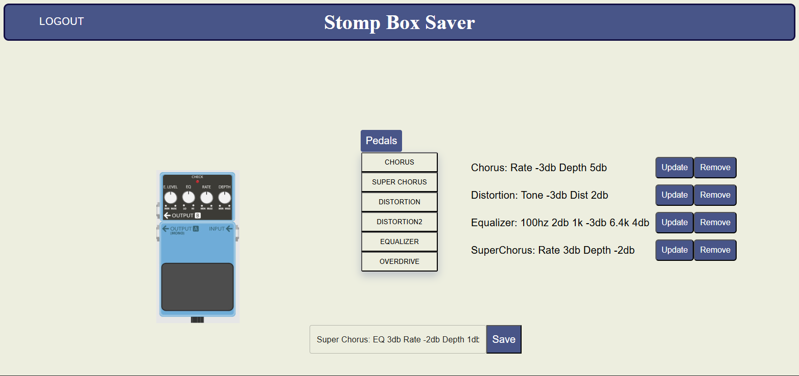

# PedalBoard Saver

## How do live musicians remember settings? This asks the big question. Memorizing the settings for the sounds we achieved can be tricky. The app allows an on the road musician to just do that. Using pedals that many of us own or use we can save presets and experiment with new ideas. 

* Save a preset name.
* Click on any field to set the knob settings.
* Scroll down to see the saved settings.
* Modify the knob settings or choose to clear.

 
 

## Deploy (Heroku)

<a href="https://polar-fortress-83075.herokuapp.com/"
target="_blank">Launch App</a>

